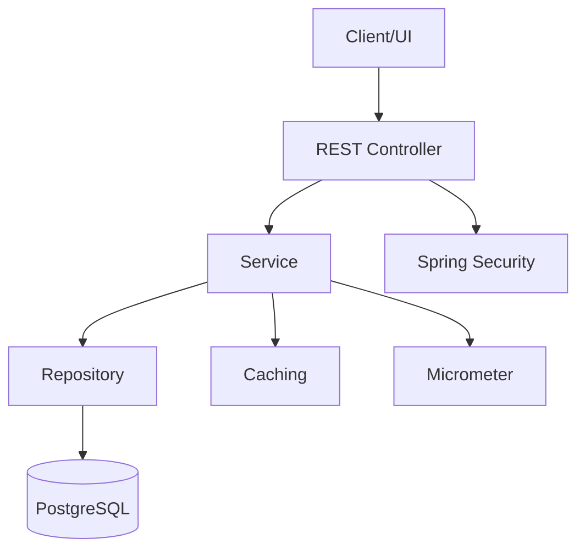

---
# E-Shop Architecture Overview

## Layers
- **Controller**: REST endpoints, validation, security, rate limiting
- **Service**: Business logic, caching, retry, metrics
- **Repository**: JPA, projections, full-text search
- **Entity**: JPA entities, DB mapping

## Key Technologies
- Spring Boot 4, Java 21
- Hibernate/JPA, MapStruct
- Caffeine, Ehcache, JCache
- PostgreSQL, Flyway
- Micrometer, Prometheus
- Spring Retry, Spring Security

## Security
- JWT authentication, RBAC
- Input validation, method-level security
- Rate limiting (controller level)

## Monitoring
- Micrometer metrics for key actions
- Audit logs for create/update/delete

## Diagram

---